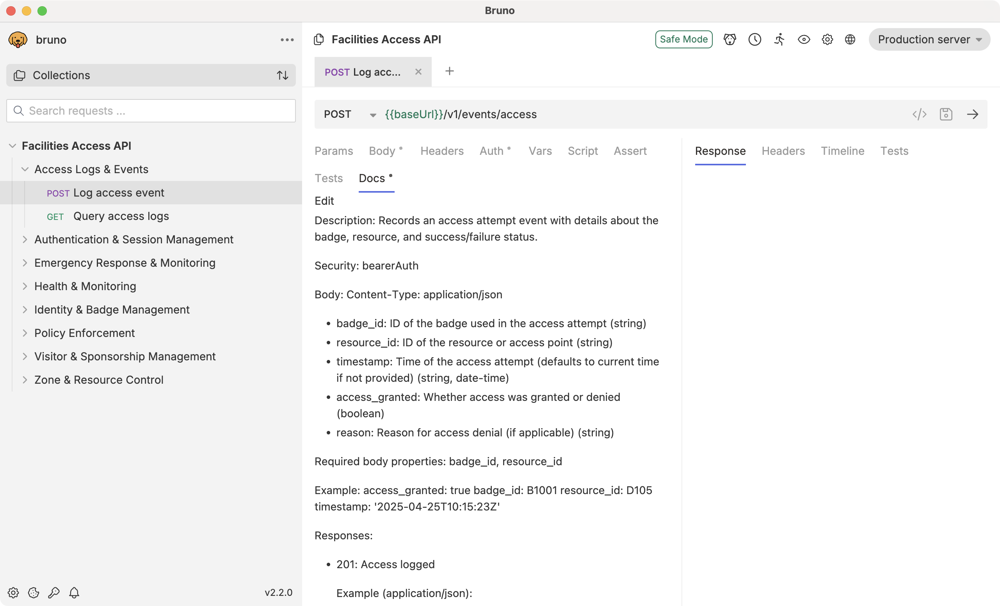

# AutoBrunoDoc

[Bruno](https://github.com/usebruno/bruno) does not take advantage of much of the documentation resource included in an OpenAPI file. Elements like endpoint description, parameter description, response type, and examples are not visible within Bruno after importing the OpenAPI file.

This script updates the Bruno workspace `.bru` files with documentation extracted from the OpenAPI v3 file, using the `docs { }` key in the `.bru` file. After running this script, documentation in the OpenAPI file will be displayed in the Bruno path **Docs** tab.



Copyright 2025, Joshua Wright.
Written using Copilot and Claude 3.7 Sonnet.

## Features

- Extracts comprehensive documentation from OpenAPI v3.0.0 specification files
- Adds or appends to the `docs` section in Bruno `.bru` files
- Creates backups of modified `.bru` files before making changes
- Provides a revert command to restore files from backups

## Installation

### Prerequisites

- Python 3.6 or higher
- PyYAML package

### Setup

1. Clone this repository or download the script:

```bash
git clone https://github.com/username/autobrunodoc.git
cd autobrunodoc
```

2. Install the required dependencies:

```bash
pip install -r requirements.txt
```

### Sample

Use the sample OpenAPI file in the `sample` directory to test the script.

* Import into Bruno, select directory
* Run `python3 autobrunodoc.py doc -o ./sample/facility-access-api.yaml -w "~/your-collection-dir/Facilities Access API"`

## Usage

AutoBrunoDoc provides two primary commands:

### Document Generation

Extract documentation from an OpenAPI file and update Bruno `.bru` files:

```bash
python3 autobrunodoc.py doc --openapi <openapi_file> --workspace <bruno_folder>
```

Or using the short options:

```bash
python3 autobrunodoc.py doc -o <openapi_file> -w <bruno_folder>
```

#### Example

```bash
python3 autobrunodoc.py doc --openapi ./sample/facility-access-api.yaml --workspace ~/Projects/bruno-collections/facility-access
```

### Reverting Changes

Restore `.bru` files from the `.bak` backups created during documentation extraction:

```bash
python3 autobrunodoc.py revert --workspace <bruno_folder>
```

Or using the short option:

```bash
python3 autobrunodoc.py revert -w <bruno_folder>
```

#### Example

```bash
python3 autobrunodoc.py revert --workspace ~/Projects/bruno-collections/facility-access
```

## How It Works

1. **Documentation Extraction**:
   - Reads the OpenAPI specification file
   - Extracts descriptions, parameters, request/response bodies, examples, and security information
   - Organizes documentation by API paths and methods

2. **Bruno File Matching**:
   - Locates Bruno `.bru` files by matching API operation tags and summaries
   - Identifies the appropriate Bruno files for each API endpoint

3. **Documentation Integration**:
   - Creates a backup of each Bruno file before modifying it
   - Checks if a `docs` element already exists in the Bruno file
   - Either adds a new `docs` element or appends to the existing one
   - Formats the documentation in a human-readable structure

## Bruno Docs Format

The script adds documentation to Bruno files in the following format:

```
docs {
  Description: [API endpoint description]

  Security: [security requirements]

  Parameters:
    * [parameter_name] ([location], [required/optional]): [description]

    Example: [parameter example]

  Body:
    Content-Type: [content type]
    * [property_name]: [description] ([type])

    Required body properties: [required properties]

    Example:
      [formatted example]

  Responses:
    * [status_code]: [response description]

    Example ([content_type]):

      [formatted example]
}
```

## License

This project is licensed under the MIT License - see the LICENSE file for details.
